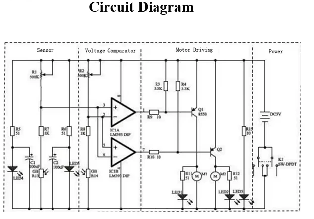

In this section we build a [line following car from here](https://www.aliexpress.com/item/1005005178035518.html).

Completeing this project learner learn.

- A basic intro into Ohms Law.
- How to read resistors and capacitors.
- How to use a soldering iron safely.
- Basic soldering skills.
- Wire crimping and joining.
- Basic electric motors.
- Basic circuit design as we draw the circuit up in tinkercad.
- LED's and how they work.
- Photoresistors and how they work.

